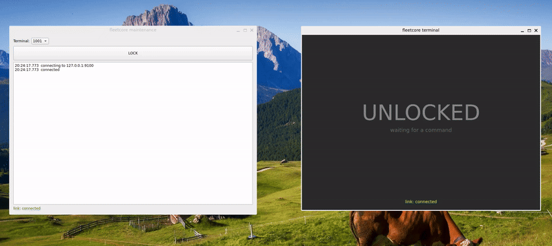

# fleetcore

A contract-driven command and telemetry backbone for vehicle terminals.
Modern C++17 and Qt6 on Linux.



A command travels from the maintenance screen, through three server
processes, over TCP to a vehicle terminal, and the acknowledgement returns
the same way. Every byte on the wire is checked against a layout the
compiler enforces.

---

## Why this exists

Binary protocols require both ends to agree byte for byte. But in C++, a
struct whose layout is wrong still compiles:

- the compiler inserts padding you did not ask for
- a field is added, removed, or reordered on one side only
- the common header is left out of a message struct entirely

None of these is a compile error. They surface at runtime as "the value
looks wrong somehow", and finding them means counting bytes in a log.

I spent a day tracking down exactly that: a message struct was missing its
header declaration, so every field after it was read from the wrong offset.
The contract existed only as a written specification. Nothing checked it.

fleetcore is a clean-room reimplementation of that class of system, built to
make the contract machine-checkable.

## The core idea

```cpp
#pragma pack(push, 1)
struct LockRequest {
    Header header;
    char   term_no[4];
};
#pragma pack(pop)

static_assert(sizeof(LockRequest) == 24, "LockRequest total size");
static_assert(offsetof(LockRequest, term_no) == 20,
              "term_no must start immediately after the common header");
```

Delete the `Header header;` line and the build fails:

```
error: static assertion failed: term_no must start immediately after the
common header
```


A day of log-reading becomes a compile error. Zero runtime cost, and no test
to remember to run — building the project is the check.

`layout_dump` prints the measured layout so the expected values are read off
the machine rather than guessed. They are still cross-checked by hand
against the field table first: copying the measured values straight into the
assertions would make them tautological, and a genuinely wrong layout would
be frozen in place looking perfectly healthy.

## Architecture

```
maint_gui (Qt6)              maintenance screen
    │ TCP :9100
    ▼
gateway   (index 1000)       parse: bytes to structs, validates the contract
    │ System V message queue
    ▼
locator   (index 2000)       resolve: terminal number to process index
    │ System V message queue
    ▼
termd     (index 3000+n)     transform: one process per terminal
    │ TCP :9200+n
    ▼
term_gui  (Qt6)              vehicle screen: lock display
```

Uplink acknowledgements go from `termd` straight back to `gateway`:
resolution is a downlink concern, and the asymmetry is deliberate — see
ADR-0010.

A few decisions that shape everything else:

**Process indices carry the terminal number.** `termd` for terminal 1 is
index 3001, owns queue `0x46431bb9`, listens on port 9201. `ipcs -q` and
`ss -tln` map every resource back to a terminal at a glance.

**Shared memory holds state, message queues carry events.** State can be
read repeatedly and non-destructively; an event is consumed by exactly one
reader. Conflating them is a common source of subtle bugs.

**Uplink may be dropped, downlink may not.** A newer status supersedes an
older one, so a lost status report costs nothing. A lost command is a
command that never happened.

**Failures are classified by reach, not by kind.** `Message` means drop this
one and read the next; `Stream` means the byte stream lost sync and nothing
after it is parseable; `Peer` means one terminal is unreachable while the
others keep working; `Process` means exit and let the supervisor restart.
The level appears in the log, so the recovery strategy is readable rather
than inferred from whether the code says `continue` or `break`.

Full detail: [`docs/ARCHITECTURE.md`](docs/ARCHITECTURE.md).

## Design decisions

Every decision is recorded with its alternatives, its cost, and a way to
tell later that it was wrong.

| # | Decision | Status |
|---|---|---|
| [0001](docs/decisions/0001-qlocalsocket-over-dbus.md) | QLocalSocket for intra-terminal IPC | proposed |
| [0002](docs/decisions/0002-sqlite-hashed-password.md) | Credentials in SQLite, hashed | proposed |
| [0003](docs/decisions/0003-static-assert-layout-check.md) | Layout verified by `static_assert` | adopted |
| [0004](docs/decisions/0004-codegen-over-handwritten-proto.md) | Generate message definitions from a schema | proposed |
| [0005](docs/decisions/0005-route-provider-abstraction.md) | External routing behind an interface | proposed |
| [0006](docs/decisions/0006-drop-policy-per-message.md) | Retry policy in the message definition | proposed |
| [0007](docs/decisions/0007-msgq-per-process.md) | One message queue per process | adopted |
| [0008](docs/decisions/0008-memcpy-based-pack-unpack.md) | memcpy-based pack/unpack | adopted |
| [0009](docs/decisions/0009-error-handling-style.md) | Two-layer error handling | adopted |
| [0010](docs/decisions/0010-uplink-path-and-dual-input.md) | Uplink path; two input sources | adopted |
| [0011](docs/decisions/0011-length-prefixed-framing.md) | Framing recovered from the length field | adopted |
| [0012](docs/decisions/0012-terminal-thread-model.md) | Worker thread plus GUI thread, signals only | adopted |
| [0013](docs/decisions/0013-gateway-tcp-listener.md) | gateway listens on TCP | adopted |

The documents are written in Japanese; the code and this README are in
English.

## Build and run

```
sudo apt install qt6-base-dev cmake g++
cmake -B build && cmake --build build
```

Start back to front — a receiver's queue must exist before a sender can
reach it:

```
./build/termd 1
./build/locator
./build/gateway
./build/term_gui 1
./build/maint_gui
```

Then press LOCK. Or run everything at once:

```
./scripts/demo.sh
```

Inspecting what is running:

```
ipcs -q                  # one queue per process, keys carry the index
ss -tlnp | grep 92       # one listener per terminal
```

## Layout

```
common/     the contract (proto.h, wire) and the OS primitives it rides on
gateway/    parse
locator/    resolve
termd/      transform, one process per terminal
term_gui/   vehicle screen: Qt, two threads
maint_gui/  maintenance screen: Qt, two threads
tools/      msggen: produces a real frame for testing
docs/       architecture, config ledger, decision records
```

Both Qt programs use the same shape: a worker thread owns the socket, the
GUI thread draws, and they exchange signals only. Qt queues a cross-thread
signal into the receiver's event loop instead of calling into it — the same
principle the server processes use with message queues, one level down. No
mutex appears in either program.

## What is not here yet

Stated plainly, because a reader will notice anyway:

- **Code generation** (ADR-0004). The design is written down — schema
  format, why not Protocol Buffers, and how to falsify the claim that the
  generator is not tied to one protocol. Implementation is the next
  substantial piece of work.
- **CI.** Cross-compiler builds would test whether `#pragma pack` really
  behaves identically on GCC, Clang and MSVC, which ADR-0008 currently
  assumes.
- **Unit tests.** The pure functions in `wire` are the obvious starting
  point.
- **Shared-memory terminal table.** `locator` still resolves against a
  hard-coded map.
- **Signal handling.** `Ctrl+C` skips destructors, so message queues survive
  and the next run inherits their unread messages. Clean up with `ipcrm -Q`
  meanwhile.
- **Store-and-forward.** A command for a terminal that is not connected is
  currently lost.

## Provenance

The architecture follows patterns used in multi-process dispatch systems the
author works on professionally. No source code, message numbers, struct
definitions or process names were carried over; this is a clean-room
reimplementation of the design ideas alone.

## Licence

MIT
